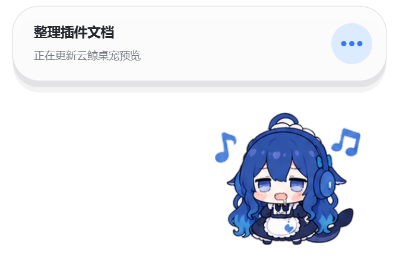

# Drool Whale Pet for DSH

English | [中文](README.md)

## Preview

<p align="center">
  
</p>

## Download

For DSH Web UI on Windows 10/11 x64. Fully exit DSH, including its tray process, before installation.

[Download the ZIP](https://github.com/yunxiiQwQ/drool-whale-pet-for-dsh/archive/refs/heads/main.zip), extract it, and open PowerShell in the project directory; or use Git:

```powershell
git clone https://github.com/yunxiiQwQ/drool-whale-pet-for-dsh.git
cd drool-whale-pet-for-dsh
```

Install and start DSH:

```powershell
dsh plugin --profile web add .
dsh --profile web
```

Configure size, bubbles, and motion under **Settings → Plugins → Plugin config → Whale companion**, or use the whale button at the bottom-right of the workspace to toggle it immediately.

To uninstall:

```powershell
dsh plugin --profile web remove @dsh-external/dsh-client-plugin-drool-whale-pet
```

## Actions

| Preview | Action | Trigger |
| --- | --- | --- |
|  | Idle | DSH has no active session |
|  | Sleeping | DSH is disconnected |
|  | Thinking | A task starts or the agent is analysing |
|  | Working | The agent edits files or uses a general tool |
|  | Searching | The agent searches, reads, or opens content |
|  | Commanding | The agent uses a shell, terminal, or PowerShell |
|  | Testing | The agent runs tests, checks, builds, or linting |
|  | Waiting | The agent asks a question, requests approval, or is blocked |
|  | Success | Briefly shown when a task completes |
|  | Error | Shown when a tool or task fails |
|  | Dragging | Hold and move the companion |
|  | Head pat | Click the head or double-click the companion |
|  | Poke | Click the body area |
|  | Tail touch | Click the tail area |
|  | Idle action | Randomly plays surprise, confusion, or eating while idle |

## Notice

- The plugin reacts only to DSH session events. It does not read keys, capture screenshots, or send telemetry.
- Its configuration endpoint accepts local same-origin requests only and opens no additional listening port.
- Project code is licensed under [BSD-3-Clause](LICENSE).
- The companion bridge and Python runtime are based on [QCYTSN/dsh-dafeiyu](https://github.com/QCYTSN/dsh-dafeiyu) (MIT). See [NOTICE](NOTICE) for animation attribution and the complete third-party license.
